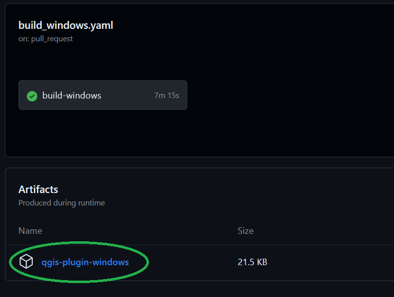
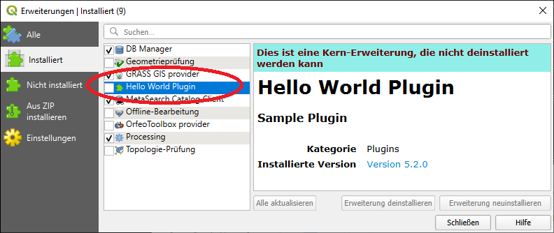
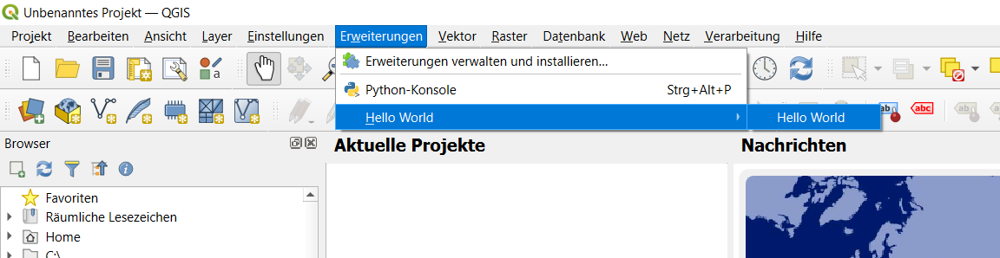

# A Sample QGIS Plugin in C++

A minimum sample of a C++ plugin for QGIS to help you get started.


## Download pre-built Plugin

The GitHub Action CI jobs build the plugin ready-to-use for all platforms (Windows, Apple and Linux).
Download the library for your platform and QGIS version from the CI jobs below.
[macOS](https://github.com/Danaozhong/cpp-simple-qgis-plugin/actions/workflows/build-macos.yaml)
[Windows](https://github.com/Danaozhong/cpp-simple-qgis-plugin/actions/workflows/build-windows.yaml)
[Linux](https://github.com/Danaozhong/cpp-simple-qgis-plugin/actions/workflows/build-linux.yaml)

## Background

If you want to write a plugin for QGIS, I highly recommend to write it in Python. It is platform independent, the API is more stable / less likely to break your plugin, and the documentation is much better.

However, in some cases there is still a use case for C++ plugins: for example, if your plugin requires computation-intensive work, such as processing large data or binary deserialization. In these cases, Python code may run into performance bottlenecks due to the GIL. While there are many workarounds to make Python faster, it doesn't reach the performance of C++.

When I evaluated C++ plugins in QGIS, I realized that there is almost no documentation  on how to do it, and most sample code was >7 years old and failed to compile.

That's why I provided this sample. It works with QGIS 3.34, comes with both CMake and QMake support, and provides sample CI jobs to build the plugin for you. The code is the bare minimum to write a working C++ QGIS plugin.

Only use C++ plugins if you really have to. You'll need to provide builds for every platform you want to support. The QGIS API is frequently changing, and every API change will break your plugin. You will either need to pin your QGIS version, or have a matrix of CI jobs for every QGIS version. General maintenance is higher.

## Prerequisites

You can build this plugin either using QMake  (QMake is a build environment used for projects that use Qt), or the recommended way, CMake.
Besides having CMake installed, you also need to have the QGIS developer dependencies installed (the QGIS API).

### Windows

Don't use a preinstalled QGIS. Install [OSGeo4W](https://trac.osgeo.org/osgeo4w/), and use install QGIS and the developer dependencies as well. You will need to install the following components:

- `qgis`
- `qgis-deps`
- `qgis-common`
- `qgis-devel`

If your plugin is using Qt, also install the following dependencies:

- `qt5-devel`
- `qt5-libs`
- `qt5-tools`
- `qt5-libs-symbols`

You can look at the [Windows GitHub Action](https://github.com/Danaozhong/cpp-simple-qgis-plugin/blob/main/.github/workflows/build-windows.yaml) in this repository to see how to install the dependencies automatically.

These packages include the QGIS API headers (for example `qgsconfig.h`), and the static libraries (`qgis_core.lib`, `lqgis_gui.lib`) required to compile a plugin. If you want to use the plugin in a pre-installed QGIS, you can be sure that the libraries and headers fit to the installed QGIS version.
If you are using `OSGeo4W`, there is no need to build QGIS yourself.

Make you you have Visual Studio installed. The pre-built QGIS libraries in `OSgeo4W` were built with MSVC, so you need to use MSVC as well for compiling the plugin. I am using Visual Studio 2022.

For the CMake configuration to work, CMake must be able to find the path to the following libraries:

- `OSGeo4W`: set the environment variable `OSGEO4W_ROOT` to your OSGEO4W installation directory.
- `Qt5`: set the `Qt5_DIR` environment variable to the Qt5 installation directory. If you are using Qt5 delivered with OSGeo4W, simply use:

```shell
export OSGEO4W_ROOT = C:/OSGeo4W
export Qt5_DIR = <OSGEO4W_ROOT>/apps/Qt5
```

### macOS (ARM or x86)

QGIS support for macOS is badly maintained. It took me a long time to get a working QGIS plugin without having to recompile QGIS.
The key is to use the compiled static QGIS libraries from the official QGIS installation, and re-generate the header files, so that you can link the libraries. To make this step simpler, I wrote a small [CI job](https://github.com/Danaozhong/cpp-simple-qgis-plugin/actions/workflows/build-macos-dependencies.yaml) to make the generation of the build dependencies easier.

For convenience, I stored the resulting QGIS static libraries directly in this repository, one folder per QGIS version. Reference the path to the QGIS libraries using the `QGIS_BUILD_PATH` environment variable.

You will also need to install Qt. For this, a script can be used:

```shell
wget https://qgis.org/downloads/macos/deps/qt-5.15.2.tar.gz
wget https://qgis.org/downloads/macos/deps/install_qgis_deps-0.9.0.bash
chmod +x ./install_qgis_deps-0.9.0.bash
sudo .//install_qgis_deps-0.9.0.bash
```

The script `install_qgis_deps-0.9.0.bash` can install both QGIS and Qt dependencies. In this case, we only downloaded the Qt dependencies, and the script will only install the Qt dependencies.
We don't need to install the QGIS dependencies, as we use the ones provided in the repository.

### Linux (Ubuntu)

On Ubuntu, you can simply install the `qgis_dev` package:

```shell
sudo apt install qgis-dev
```

Make sure that the package fits to the QGIS version you intend to use.

### Cross-compiling using MinGW

If you want to use MinGW, either from Linux to cross-compile for Windows, or on Windows, you will need to rebuild QGIS manually to build the `qgis_core.lib` and `qgis_gui.lib` static libraries.

## Building (CMake, Windows and Linux)

Run CMake using:

```shell
mkdir build
cd build
cmake ..
cmake --build .
```

Which should generate the build environment, and build the dynamic libraries that you can use in QGIS.

## Building (CMake, macOS)

As mentioned above, getting working build dependencies for macOS is a bit tricky, which is why I provide them right here in this repository, in the `dependencies/qgis/macos_x86_64` directory.

You can invoke CMake as follows:

```shell
mkdir build
cd build
cmake \
-DQGIS_BUILD_PATH=dependencies/qgis/macos_x86_64/3_34_2 \
-DQt5_DIR=/opt/Qt/5.15.2 \
-DCMAKE_PREFIX_PATH=/opt/Qt/5.15.2/clang_64 \
-DCMAKE_BUILD_TYPE=Release \
-DCMAKE_OSX_ARCHITECTURES=x86_64 \
..
```

Let's break this down bit by bit.

- `-DQGIS_BUILD_PATH=dependencies/qgis/macos_x86_64/3_34_2` provides CMake with the information on where to find the QGIS dependencies. As they are provided in this repository, I am using a relative path to find them.
- `DQt5_DIR=/opt/Qt/5.15.2` instructs CMake where to find the Qt installation.
- `DCMAKE_PREFIX_PATH=/opt/Qt/5.15.2/clang_64` instructs CMake to use the clang compiler shipped with Qt.
- `DCMAKE_OSX_ARCHITECTURES=x86_64` tells CMake to build for 64-bit x86 architectures. This is because so far, QGIS is still build using x86, and the plugin needs to be built for the same target architecture. On ARM machines, the x86 emulation will be used.
- Finally, we want to build in release configuration (otherwise, the created library may not work correctly with a shipped QGIS, which is also built in release mode): `CMAKE_BUILD_TYPE=Release`.

If the code generation was successful, run the build with `make`.

## Building (QMake)

Adapt the paths to MSVC and OSGeo4W in `OSGeo4W_dev.bat`. Also, please adapt the paths in `qgis_hello_world.pro`.
Setup the environment by calling :

```bash
env.bat
```

Afterwards, run `qmake` to generate a `Makefile`:

```bash
qmake
```

On Linux, run `make` to build the plugin.

```bash
make
```

On Windows, the `Makefile` only works with the MSVC build toolchain, so you need to invoke `nmake` (the `make` of MSVC):

```bash
nmake
```

## Testing

### macOS

Copy the built `libhelloworld.so` to `/Applications/QGIS/Contents/PlugIns/qgis/`.

If QGIS crashes during startup, you may have that the libraries used to build the plugin differ from the libraries used to build QGIS. Double-check that the QGIS dependencies referenced in the "Prerequisites" section matches your QGIS version.

### Windows

The build process should generate a `helloworldplugin.dll` or `libhelloworldplugin.so`. Copy it into `<OSGeo4W_Dir>\apps\qgis\plugins`.

You can also download the [CI build artifacts](https://github.com/Danaozhong/cpp-simple-qgis-plugin/actions). Click on the link, open the latest run, and download the zip file from the GitHub Action:



After restarting QGIS, the plugin should show up:



After activating the plugin, the plugin should show up in the plugin menu bar:



## Pitfalls

- When using Qt, it seems to be quite important to match debug/release configuration with the build type of your QGIS installation, i.e. use a release library for a release version of QGIS.
- The QGIS API is constantly evolving. As such, the static libraries that are used to link the plugin may not work with every QGIS version. I noticed that libraries built with QGIS 3.34 don't work on QGIS 3.24. You'll need to build for many different QGIS versions, or use only a specific QGIS version. This is another reason why Python plugins are usually a better choice, as their API is more stable.
- Logging on `stdout` doesn't seem to be active on release builds. Use `QgsMessageLog::logMessage` to make sure your logs show up in the log window.
